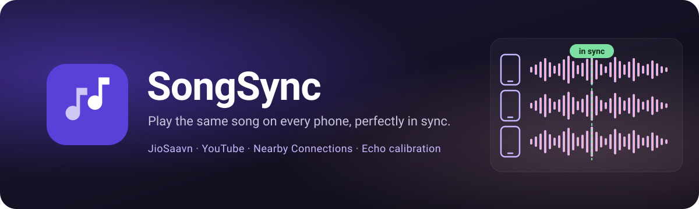
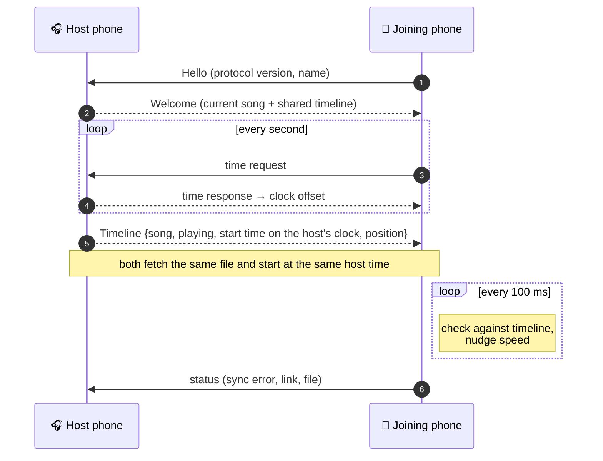
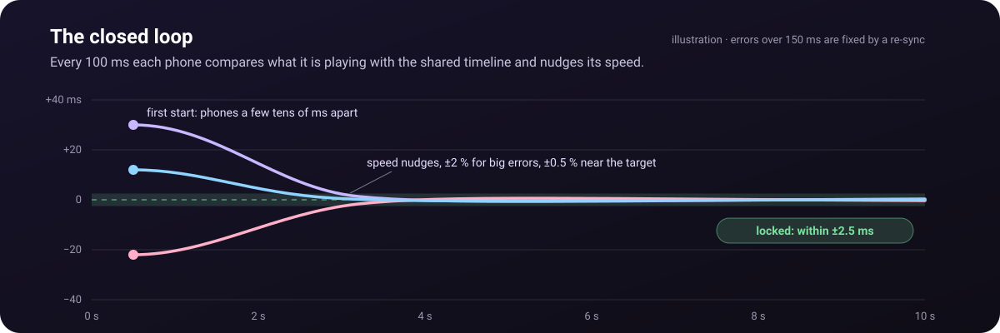
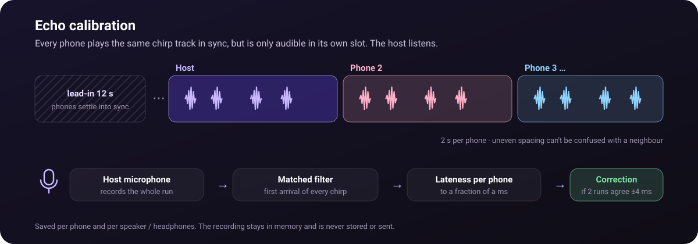
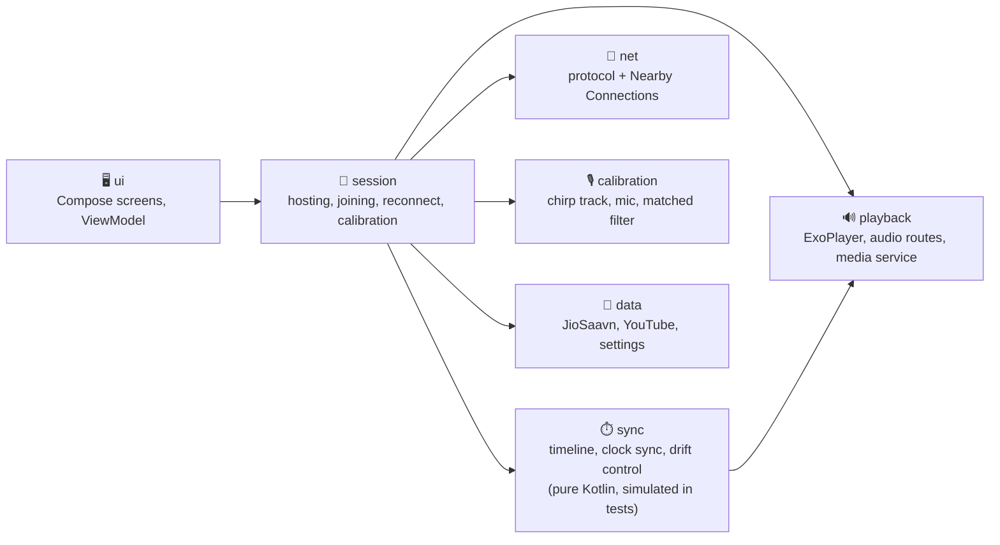

<p align="center">
  
</p>

<p align="center">
  
  
  
  
  
  
</p>

<p align="center">
  <b>Turn a handful of Android phones into one speaker system.</b><br>
  One phone hosts and picks the music, the others join, and every phone plays the same song at the same moment.
</p>

<p align="center">
  <sub>A hard fork of <a href="https://github.com/SirEthic/SongSync">SirEthic/SongSync</a> (Flutter), rewritten natively in Kotlin.</sub>
</p>

<p align="center">
  <a href="https://github.com/priencelucifer/SongSync-Kotlin/releases/latest">
    
  </a>
</p>

---

## ✨ Features

<table>
  <tr>
    <td width="50%" valign="top">
      <h3>📱 Any number of phones</h3>
      Host a group; others pick it from a list and can join or rejoin at any time, even mid-song.
      Phones find each other over Bluetooth and Wi-Fi, no shared network needed.
    </td>
    <td width="50%" valign="top">
      <h3>🎯 Millisecond sync</h3>
      One shared timeline, an NTP-style clock estimate and a closed loop that gently nudges playback speed
      every 100 ms keep the phones within a few milliseconds, without audible jumps.
    </td>
  </tr>
  <tr>
    <td valign="top">
      <h3>🎙️ Echo calibration</h3>
      The host's microphone measures each phone's real speaker or Bluetooth delay and corrects it,
      per phone and per audio output. One tap resets it on every phone.
    </td>
    <td valign="top">
      <h3>📊 Sync check &amp; full test</h3>
      Measure how far apart the phones really sound, or run the full test for a one-screen report
      (devices, clocks, links, files) with a Copy button.
    </td>
  </tr>
  <tr>
    <td valign="top">
      <h3>🎵 JioSaavn &amp; YouTube</h3>
      Search, queue and play. The host picks the exact stream (bitrate or format) and every phone fetches
      that same file itself; only IDs travel between phones.
    </td>
    <td valign="top">
      <h3>🔒 Keeps playing</h3>
      Screen off, lock-screen and headset controls, phone calls. If the link drops, phones keep playing and
      reconnect on their own. "Pause here" silences one phone while the group plays on.
    </td>
  </tr>
</table>

## 🔄 How sync works



1. **Shared timeline.** The host publishes `PlaybackState {seq, track, playing, anchorHostTime, anchorPosition}`
   on every change and once a second. Any phone can compute where the song *should* be at any instant,
   so lost messages, late joins and reconnects all heal by applying the latest state.
2. **Clock offset.** Phones exchange timestamps with the host (16 at once on connect, then 1/s) and keep
   the median offset of the fastest quarter of recent exchanges (the window widens on jittery links).
3. **Scheduled actions.** Play/pause/seek take effect at a host time a few hundred ms ahead (based on the
   measured link latency). Each phone pauses, pre-positions, and calls `play()` early by its learned start
   latency so audio comes out on time; pauses happen on the same sample everywhere.
4. **Closed loop.** While playing, each phone compares ExoPlayer's position (derived from AudioTrack
   timestamps, i.e. what is being heard) with the timeline: under 2.5 ms nothing happens, small errors
   adjust playback speed by up to ±0.5 %, larger ones by up to ±2 %, and beyond 150 ms it re-syncs.

<p align="center">
  
</p>

5. **Auto-calibrate echo.** Some delay happens after the audio leaves the app (speaker DSP, Bluetooth)
   and phones often misreport it. Every phone plays a chirp track in sync but is only audible in its own
   slot; the host's microphone records the run and a matched filter finds each chirp's first arrival to a
   fraction of a millisecond. It measures twice and corrects a phone only where both runs agree within
   4 ms; the correction is saved per speaker/headphones (at most ±120 ms for speakers and wired outputs).
   A manual fine-tune remains under Settings → Echo calibration (advanced).

<p align="center">
  
</p>

> In the whole-stack simulation (random clock offsets of ±200 ms, ±50 ppm clock drift, 40–150 ms audio
> start latency, jittery network with spikes) every phone stays within **5 ms** of the timeline
> (observed 2.5–4.5 ms). Real-world numbers depend on the phones; the in-app diagnostics show them.

## 🚀 Using it

1. Download the APK from the [latest release](https://github.com/priencelucifer/SongSync-Kotlin/releases/latest)
   and install it on every phone (allow "install unknown apps" for your browser or file manager when asked).
   Open it once and allow the permissions it asks for (Nearby devices, location, notifications).
   Every phone in a group needs the same version.
2. On one phone tap **Host a group**, search JioSaavn or YouTube and play a song.
3. On the others tap **Join a group** and pick the host. They start playing in sync within a second or two.
4. For the tightest sync, put the phones near the host and tap ⋮ → **Auto-calibrate echo** once, then
   ⋮ → **Check sync** to see the result.

## 🛠️ Building

Requirements: JDK 17+ (21 recommended), Android SDK with platform 37 (`compileSdk`; the app targets 36).

```bash
echo "sdk.dir=$HOME/Android/Sdk" > local.properties   # or open the project in Android Studio
./gradlew assembleDebug            # app/build/outputs/apk/debug/app-debug.apk
./gradlew testDebugUnitTest        # unit + simulation tests
./gradlew lintDebug
./gradlew assembleRelease          # R8-minified, ~4 MB
```

### Release signing

Create `keystore.properties` in the project root (it is git-ignored):

```properties
storeFile=release.jks
storePassword=...
keyAlias=songsync
keyPassword=...
```

Without it, release builds are signed with the debug key so they still install locally.

### Baseline profile (optional, needs a phone)

With a phone connected over adb: `./gradlew :app:generateReleaseBaselineProfile`, then commit the
generated `app/src/release/generated/baselineProfiles/`. Makes the first launch smoother.

## 🧪 Tests

- `sync/` – clock sync, timeline, drift controller, and `SyncSimulationTest`, which runs a host and
  several clients with simulated clocks, audio hardware and network, asserting on what a listener would hear:
  convergence, pause/seek/resume, a late joiner, a dropped link, queue auto-advance.
- `calibration/` – chirp detection and per-phone offsets from synthetic recordings (mic delay, loudness,
  louder-than-direct reflections, noise, unheard phones): offsets recovered within 0.3 ms.
- `data/` – JioSaavn decryption (FIPS DES vector + a real payload), parsing, click track, downloader cancellation.
- `net/` – protocol round trips, endpoint info.
- Live smoke tests against the real services are opt-in: `./gradlew testDebugUnitTest -PliveTests`.

### On real phones

Nearby Connections does not work in the emulator, so final checks need two or more phones:

1. Host on one phone, join from the list on the others. Play, pause, seek, skip.
2. Settings → Sync diagnostics: the sync error should stay within about ±10 ms.
3. Host → **Auto-calibrate echo** (phones in place, volume up, room quiet), then **Check sync**: it measures
   each phone against the host with the microphone and changes nothing. Targets: spread ≤ 2 ms excellent,
   ≤ 5 ms good, ≤ 10 ms acceptable; above about 8 ms an echo becomes audible on sharp sounds.
4. Lock the screens for 10 minutes: playback continues.
5. Turn Wi-Fi/Bluetooth off and on on a client: it keeps playing, rejoins, and re-syncs.
6. Join mid-song; take a phone call on a client (it pauses and re-syncs afterwards).
7. Jank: `adb shell dumpsys gfxinfo com.songsync.app` while scrolling results and with the player open.

### Independent sync measurement (external recording)

An outside check on **Check sync** that also shows slow drift over a whole song:

1. Put the phones in a row, each about 10 cm from a laptop (or a spare phone) microphone, all at the same
   distance. Sound travels about 2.9 ms per metre, so unequal distances show up as fake offsets.
2. Host → **Play sync test** (click track), volume up on every phone, room quiet.
3. Record 5 minutes (Audacity, 48 kHz).
4. Zoom in on one click at 0:30, 2:30 and 4:30 and note the time between the first and last onset of that
   click. That is the spread.
5. Swap the phones' positions and repeat: an offset that follows the phone is the phone's; one that stays
   with the position is geometry.

Three runs should agree within about 0.5 ms. A spread that grows from 0:30 to 4:30 means drift is not being
corrected (phone clocks differ by up to about 80 ppm, which is about 5 ms per minute uncorrected).

## 🗂️ Project layout



```
app/src/main/java/com/songsync/app/
  data/       Track model, JioSaavn + YouTube sources, search cache, settings, click track
  net/        Wire protocol (kotlinx.serialization), Transport interface, Nearby implementation
  sync/       Timeline, ClockSync, DriftController, PlaybackFollower, host/client coordinators (pure Kotlin)
  playback/   ExoPlayer engine, precise scheduler, audio routes + latency profiles, media session service
  session/    SessionManager: discovery, hosting/joining, reconnect, recovery, sync report
  calibration/ Chirp track, microphone recorder, chirp detector and analyzer
  ui/         Compose screens and the ViewModel
baselineprofile/  Baseline profile generator
```

## 💡 Notes & troubleshooting

- JioSaavn and YouTube are used through unofficial interfaces, which can change or break at any time;
  each source sits behind `MusicSource`. YouTube extraction is not allowed on Google Play, so distribute
  the APK directly (e.g. GitHub Releases).
- Bluetooth speakers and headphones add latency that phones report inconsistently; that is what the
  per-output calibration is for.
- Nearby works best when it can use Wi-Fi; on Bluetooth-only links the clock estimate is noisier.
- If a phone does not see a group, turn its Bluetooth off and on and search again. Android 8 throttles
  Bluetooth scanning once Play services has scanned for a long time (`dumpsys bluetooth_manager` then shows
  its scanner as "Forced-Opportunistic" with 0 results); toggling Bluetooth resets it.
- The app asks for precise location on every Android version: Google's documentation says it is not needed
  on Android 13+, but Play services' discovery fails with `MISSING_PERMISSION_ACCESS_FINE_LOCATION` (8036) /
  `..._COARSE_LOCATION` (8034) without it (hosting is unaffected). The app never reads the location. Nearby
  errors shown in the app include the status code and a shortcut to the right settings screen.

## 📄 License

GPL-3.0-or-later (see `LICENSE`), because the app includes NewPipe Extractor. SongSync is a hard fork of
[SirEthic/SongSync](https://github.com/SirEthic/SongSync) (MIT); its notice and the third-party notices are in
`NOTICE`.
